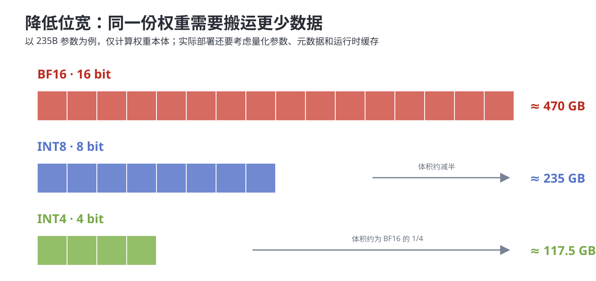
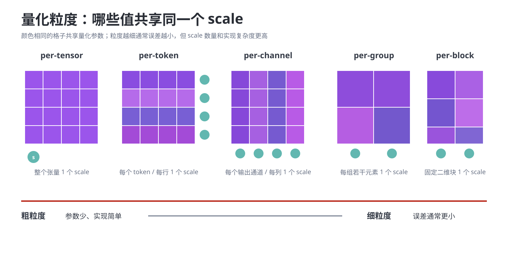
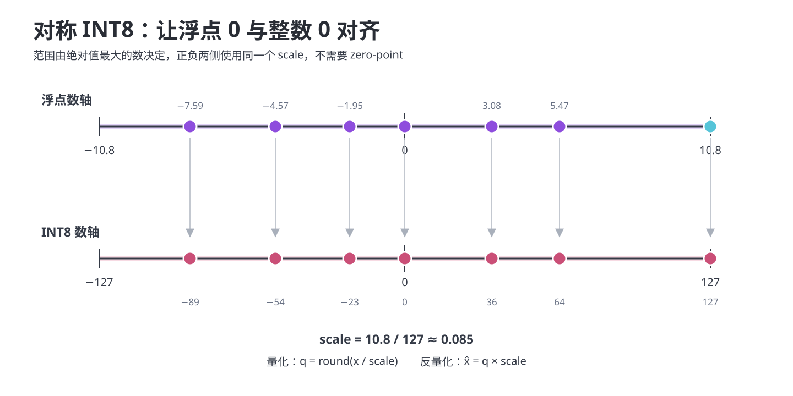
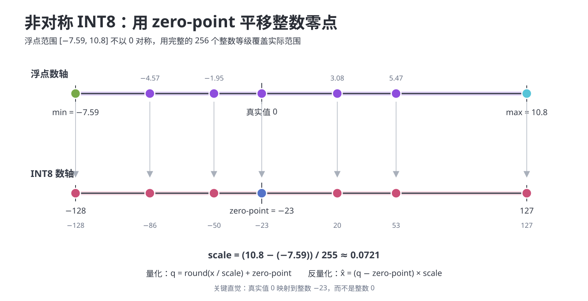
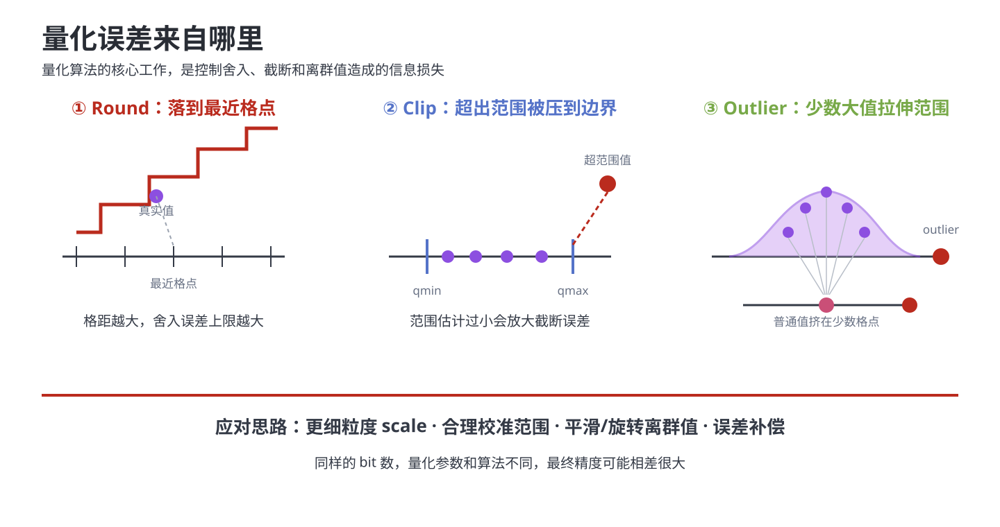
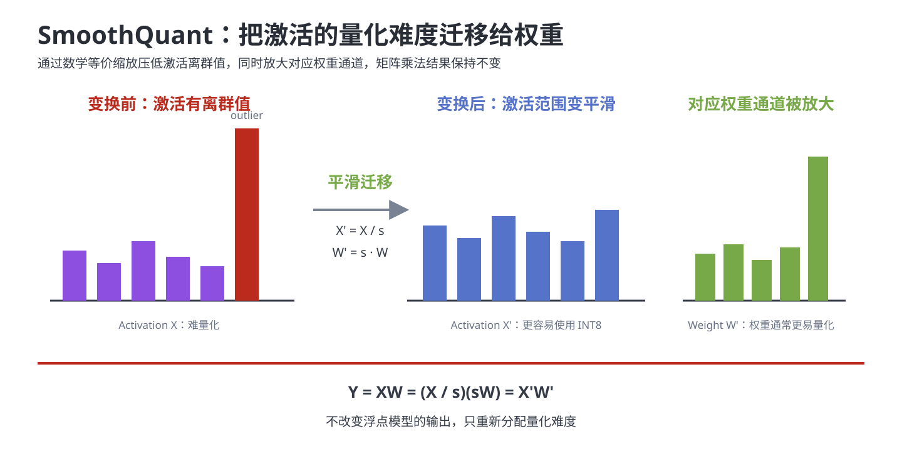
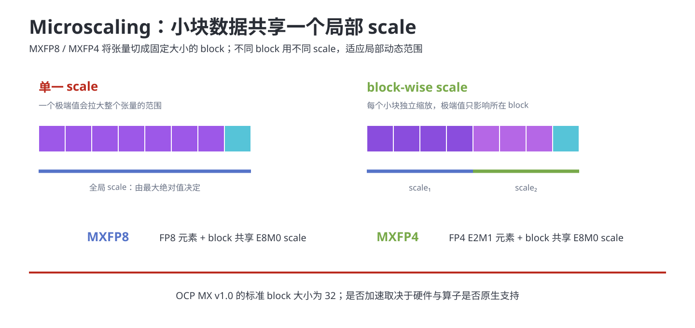

# 大模型量化基础

量化（Quantization）：将高精度数值映射为低精度数值，并用少量量化参数近似恢复原值。

它既是大模型推理优化的一种手段，也是一套独立的数值表示与精度控制技术。核心目标不是“bit 越低越好”，而是在精度、显存、带宽、算力和部署复杂度之间取得平衡。

## 内容概览

1. 为什么需要量化
2. 数值格式、量化对象、粒度与映射
3. W8A8 与 SmoothQuant
4. PTQ、QAT 和主流量化算法
5. 低比特格式

## 为什么需要量化

大模型推理的主要压力：

- **显存容量**：模型权重、KV Cache 和中间激活都占用显存。
- **显存带宽**：Decode 阶段经常需要反复读取权重和 KV Cache，容易受访存限制。
- **计算能力**：硬件的低精度矩阵计算吞吐通常高于高精度计算。
- **时延与吞吐**：量化可能降低 TTFT、TPOT，并提高 TPS 和并发容量。

一个拥有 $P$ 个参数、每个参数占 $b$ bit 的模型，权重理论体积为：

$$
\operatorname{Size}=\frac{P\times b}{8}
$$

例如 235B 参数模型的权重本体：BF16 约为 470 GB，INT8 约为 235 GB，INT4 约为 117.5 GB。



> 这是理论值。实际部署还要保存 scale、zero-point、分组信息和对齐填充，并占用 KV Cache、激活与运行时工作区。

### 量化为什么可能加速

低位宽可以同时带来三类收益：

1. 单个元素更小，相同带宽可以搬运更多数据。
2. 模型更小，显存可容纳更大的 batch 或更长的上下文。
3. 当硬件与算子原生支持低精度矩阵乘法时，可以使用更高的计算吞吐。

但“文件变小”不等于“一定变快”。如果执行前必须频繁反量化到 FP16，或硬件没有对应低精度 kernel，可能只有显存收益而没有明显速度收益。

## 量化基础概念

### 数值格式

| 格式 | 位数 | 结构或范围 | 典型用途 | 主要特点 |
| --- | ---: | --- | --- | --- |
| FP32 | 32 bit | E8M23 | 训练、参考精度 | 精度高，成本高 |
| FP16 | 16 bit | E5M10 | 训练与推理 | 尾数较多，动态范围小于 BF16 |
| BF16 | 16 bit | E8M7 | 训练与推理 | 动态范围接近 FP32，精度低于 FP16 |
| FP8 E4M3 | 8 bit | 1 个符号位、4 个指数位、3 个尾数位 | 低精度训练与推理 | 精度优先 |
| FP8 E5M2 | 8 bit | 1 个符号位、5 个指数位、2 个尾数位 | 梯度等大动态范围数据 | 范围优先 |
| INT8 | 8 bit | 常用 $[-128,127]$ 或对称 $[-127,127]$ | W8A8、KV Cache | 硬件成熟，工程稳定 |
| INT4 | 4 bit | 常用 $[-8,7]$ 或对称范围 | W4A16、W4A8、KV Cache | 压缩强，对误差敏感 |
| FP4 | 4 bit | 多种编码方案 | 前沿训练与推理 | 动态范围比 INT4 灵活，但依赖格式与硬件 |

浮点格式通过指数位换取动态范围，通过尾数位换取精度；整数格式依靠额外的 scale 和 zero-point 表示实数范围。

### 量化对象

权重、激活和 KV Cache 可以独立选择是否量化：

| 对象 | 特点 | 常见方案 |
| --- | --- | --- |
| 权重（W） | 训练后固定，可离线统计和量化 | W8A16、W4A16、W4A8 |
| 激活（A） | 随输入和 token 动态变化，容易出现离群值 | W8A8、W4A8 |
| KV Cache | 随上下文长度增长，Decode 阶段反复读取 | KV INT8、KV INT4 |

命名规则：`W8A8` 表示权重 8 bit、激活 8 bit；`W4A16` 表示权重 4 bit、激活通常保持 16 bit。

### 量化粒度

量化粒度：一组数值共享量化参数的范围大小。



| 粒度 | 共享方式 | 优点 | 代价 |
| --- | --- | --- | --- |
| per-tensor | 整个张量共享一个 scale | 参数少，实现简单 | 容易受离群值影响 |
| per-token | 每个 token 或每行一个 scale | 适应激活的 token 差异 | 推理时要动态计算 scale |
| per-channel | 每个通道一个 scale | 适应权重通道差异 | scale 更多 |
| per-group | 每组若干连续元素一个 scale | 常用于 INT4 权重量化 | 需要分组和元数据 |
| per-block | 每个二维块一个 scale | 适合块缩放和硬件矩阵单元 | 布局与 kernel 更复杂 |

粒度越细，局部范围通常估计得越准确，但量化参数、访存和实现成本也会增加。

## 量化映射

均匀量化使用等间距格点近似连续实数。其基本过程为：

```text
高精度 x --> 根据 scale / zero-point 映射 --> 整数 q
整数 q   --> 反量化                         --> 近似值 x_hat
```

### 对称 INT8 量化

对称量化让浮点 0 与整数 0 对齐，并让正负范围关于 0 对称。以 signed INT8 的 $[-127,127]$ 为例：

$$
s=\frac{\max(|x|)}{127}
$$

$$
q=\operatorname{clip}\left(\operatorname{round}\left(\frac{x}{s}\right),-127,127\right)
$$

$$
\hat{x}=q\times s
$$



数值例子：

```text
x = [5.47, 3.08, -7.59, 0, -1.95, -4.57, 10.8]
max(|x|) = 10.8
s = 10.8 / 127 ≈ 0.0850
q(5.47) = round(5.47 / 0.0850) = 64
x_hat = 64 × 0.0850 ≈ 5.44
```

优点：公式简单，零值精确表示，通常适合权重。  
局限：当数据范围明显偏向 0 的一侧时，会浪费另一侧的整数等级。

### 非对称 INT8 量化

非对称量化使用 zero-point 将浮点零点平移到某个整数值，能够更充分地覆盖不对称的数据范围。

设 $q_{min}=-128$，$q_{max}=127$：

$$
s=\frac{x_{max}-x_{min}}{q_{max}-q_{min}}
$$

$$
z=\operatorname{clip}\left(
\operatorname{round}\left(q_{min}-\frac{x_{min}}{s}\right),
q_{min},q_{max}
\right)
$$

$$
q=\operatorname{clip}\left(
\operatorname{round}\left(\frac{x}{s}\right)+z,
q_{min},q_{max}
\right)
$$

$$
\hat{x}=(q-z)\times s
$$



对同一组数据：

```text
x_min = -7.59, x_max = 10.8
s = 18.39 / 255 ≈ 0.0721
z = round(-128 - (-7.59 / 0.0721)) = -23
q(5.47) = round(5.47 / 0.0721) - 23 = 53
x_hat = (53 - (-23)) × 0.0721 ≈ 5.48
```

非对称量化适合数据范围明显偏向一侧的情况，但需要额外保存和处理 zero-point。

### 对称与非对称量化对比

| 维度 | 对称量化 | 非对称量化 |
| --- | --- | --- |
| 参数 | scale | scale + zero-point |
| 零点映射 | $0\rightarrow0$ | $0\rightarrow z$ |
| 计算 | 更简单 | 需要处理偏移 |
| 范围利用率 | 不对称分布下可能浪费 | 能覆盖实际最小值与最大值 |
| 常见对象 | 权重、部分激活 | 非负或偏斜激活 |

## 量化误差

量化误差主要来自三个方面：



### Round 舍入误差

连续数值必须落到离散格点。均匀量化且未发生截断时，四舍五入误差通常满足：

$$
|x-\hat{x}|\leq\frac{s}{2}
$$

scale 越大，格点越稀疏，舍入误差越大。

### Clip 截断误差

当真实值超出量化范围时，会被压到 $q_{min}$ 或 $q_{max}$。校准范围过窄会增加截断；范围过宽又会增大 scale，使普通值的格点变粗。

### Outlier 离群值

少数极大值会拉伸整组数据的量化范围，使绝大多数普通值挤在少量格点附近。激活量化通常比权重量化更困难，重要原因就是激活离群值随输入变化。

常用应对方法：

- 使用 per-channel、per-token 或 per-group 等更细粒度。
- 通过校准选择合理的截断范围。
- 用 SmoothQuant 将激活离群值迁移到权重。
- 用 AWQ 保护显著权重通道。
- 用 GPTQ 等方法补偿逐层量化误差。
- 用 QuaRot 等旋转方法改变分布，削弱离群值。

## W8A8 量化

W8A8：权重使用 INT8，激活也使用 INT8。矩阵乘法可写为：

$$
A\approx s_Aq_A,\qquad W\approx s_Wq_W
$$

$$
Y=AW\approx s_As_W(q_Aq_W)
$$

$q_Aq_W$ 的乘加通常使用更宽的累加类型，例如 INT32，再乘缩放系数恢复到目标输出精度。

### 静态量化

1. 用少量有代表性的校准数据运行模型。
2. 收集各层激活的范围或分布统计。
3. 离线计算权重 scale 和激活 scale。
4. 保存量化权重、量化参数和配置。
5. 推理时直接加载固定参数执行 INT8 计算。

优点：运行时开销小。  
风险：校准数据与真实输入分布不一致时，精度可能下降。

### 动态量化

权重提前量化；激活 scale 在推理时根据当前输入在线计算。

优点：能适应输入分布变化，通常比固定激活范围更稳健。  
代价：每次推理都要统计激活并完成量化，增加运行时开销。

| 对比项 | 静态量化 | 动态量化 |
| --- | --- | --- |
| 激活 scale | 校准后固定 | 推理时计算 |
| 校准数据 | 需要 | 通常不需要激活校准 |
| 运行时开销 | 较低 | 较高 |
| 分布适应性 | 依赖校准质量 | 较强 |

## SmoothQuant

SmoothQuant 是面向 W8A8 的训练后量化方法。它利用“权重通常比激活更容易量化”的特点，把激活离群值的量化难度迁移到权重。



对矩阵乘法 $Y=XW$，引入逐通道缩放向量 $s$：

$$
Y=XW=(X\operatorname{diag}(s)^{-1})(\operatorname{diag}(s)W)=X'W'
$$

常见缩放形式为：

$$
s_j=\frac{\max(|X_j|)^\alpha}{\max(|W_j|)^{1-\alpha}}
$$

$\alpha$ 控制量化难度从激活迁移到权重的程度。变换在浮点数学上等价，但 $X'$ 的离群值被压低，更适合 INT8 量化。

## PTQ 与 QAT

### PTQ

PTQ（Post-Training Quantization，训练后量化）：模型训练完成后再量化，通常不更新原模型参数。

典型过程：校准 --> 离线转换 --> 精度验证 --> 部署。

优点：成本低、速度快、适合工程部署。  
局限：bit 越低，越难仅靠少量校准保持精度。

### QAT

QAT（Quantization-Aware Training，量化感知训练）：在训练或微调的前向过程中模拟量化和反量化误差，反向传播仍更新浮点参数，使模型主动适应低精度。

常见做法使用 Fake Quantization：

```text
浮点参数 --> 模拟量化 --> 模拟反量化 --> 继续浮点计算与反向传播
```

由于 `round` 几乎处处不可导，训练时常用 STE（Straight-Through Estimator）近似传递梯度。

| 方法 | 发生阶段 | 是否更新参数 | 适用场景 |
| --- | --- | --- | --- |
| PTQ | 训练完成后 | 通常不更新 | 快速部署、8 bit、权重 4 bit |
| QAT | 训练或微调中 | 更新 | 更低 bit 或更高精度要求 |

## 主流量化路线

| 方法 | 核心思想 | 常见对象 | 典型特点 |
| --- | --- | --- | --- |
| RTN | Round-To-Nearest，直接舍入到最近格点 | 权重、激活 | 最简单的基线，精度通常最低 |
| GPTQ | 使用近似二阶信息逐层量化，并补偿后续权重误差 | 权重量化 | 常用于 W4A16，精度高于直接舍入 |
| AWQ | 根据激活统计识别显著权重通道，通过等价缩放保护重要权重 | 权重量化 | 常用于 W4A16，硬件友好 |
| SmoothQuant | 将激活离群值的量化难度迁移到权重 | 权重 + 激活 | 面向 W8A8 的 PTQ |
| QuaRot | 用正交/Hadamard 旋转平滑隐藏状态分布 | 权重 + 激活 + KV Cache | 面向端到端 4 bit 的研究路线 |

演进思路：

```text
直接舍入 --> 误差补偿 --> 重要通道保护 --> 分布平滑/旋转 --> 更低比特
```

GPTQ 和 AWQ 主要解决低比特权重量化问题；SmoothQuant 主要解决 W8A8 中的激活离群值；QuaRot 进一步尝试将权重、激活与 KV Cache 一起降到 4 bit。

## 精度与性能的权衡

### 主要收益

- 权重和 KV Cache 显存占用降低。
- 显存带宽需求降低。
- 支持更大的 batch、更长上下文或更高并发。
- 在原生低精度 kernel 支持下提高吞吐、降低时延。

### 主要代价

- 量化误差可能改变 token 概率分布。
- 需要校准数据、量化参数与验证流程。
- 低 bit 对离群值、层敏感性和 group size 更敏感。
- scale、zero-point 和元数据会抵消部分压缩收益。
- 硬件或算子不支持时，反量化开销可能抵消加速收益。

### 场景化选择

| 场景 | 可优先尝试 | 原因 |
| --- | --- | --- |
| 精度敏感的对话、代码 | W8A8、FP8 | 压缩适中，通常更容易保持精度 |
| 显存受限、权重带宽瓶颈 | W4A16（GPTQ/AWQ） | 权重约压缩至 1/4，激活保持高精度 |
| 长上下文和高并发 | 权重量化 + KV Cache INT8 | 同时减小权重与历史状态 |
| 极低 bit 研究或原生硬件 | QAT、QuaRot、MXFP4 | 需要算法与硬件共同控制误差 |

量化方案必须在目标硬件、目标模型和真实数据集上评测，不能只看 bit 数判断效果。

## 低比特浮点与 Microscaling

### FP8

- E4M3：尾数更多，精度优先。
- E5M2：指数更多，动态范围优先。
- 常用于低精度训练或硬件支持良好的推理场景。

### MXFP8 与 MXFP4

Microscaling（MX）将张量切成小块，每个块共享一个 scale。相比整个张量或大粒度共享 scale，它能更好地适应不同局部范围。



按照 OCP MX v1.0：

- MXFP8：每个元素使用 FP8 E4M3 或 E5M2，32 个元素共享一个 E8M0 scale。
- MXFP4：每个元素使用 FP4 E2M1，32 个元素共享一个 E8M0 scale。

低比特浮点能否带来实际速度收益，关键仍是硬件是否原生支持该格式、scale 布局以及对应矩阵乘法 kernel。

## 核心结论

1. 量化通过低精度表示减少存储、访存和计算成本。
2. 权重最容易量化，激活和 KV Cache 更受输入分布与离群值影响。
3. scale、zero-point 和量化粒度决定实数如何落到离散格点。
4. W8A8 追求计算与带宽收益，W4A16 更侧重权重压缩。
5. PTQ 部署成本低，QAT 在极低 bit 或高精度要求下更有优势。
6. 真正的加速依赖硬件、数据格式、内存布局和低精度 kernel 的共同支持。

## 参考资料

- [SmoothQuant：Accurate and Efficient Post-Training Quantization for Large Language Models](https://arxiv.org/abs/2211.10438)
- [GPTQ：Accurate Post-Training Quantization for Generative Pre-trained Transformers](https://arxiv.org/abs/2210.17323)
- [AWQ：Activation-aware Weight Quantization for LLM Compression and Acceleration](https://arxiv.org/abs/2306.00978)
- [QuaRot：Outlier-Free 4-Bit Inference in Rotated LLMs](https://arxiv.org/abs/2404.00456)
- [OCP Microscaling Formats（MX）Specification v1.0](https://www.opencompute.org/documents/ocp-microscaling-formats-mx-v1-0-spec-final-pdf)
