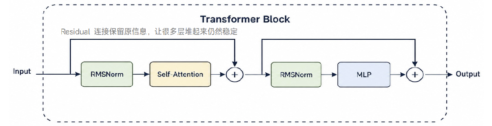
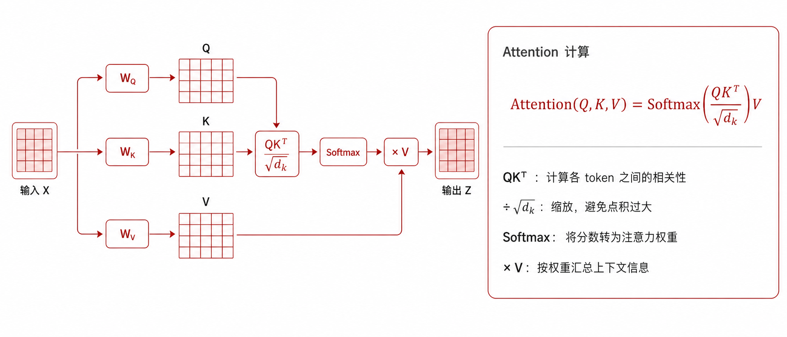

# 大模型基础知识

## 神经网络

CNN：擅长处理图像，不擅长处理长文本  
RNN：擅长处理序列但难并行，易遗忘远距离信息  
Transformer：自注意力机制（Self-Attention）

给定输入序列的表示矩阵 $X$，首先通过三个可学习的权重矩阵得到查询（Query）、键（Key）和值（Value）：

$$
Q = XW_Q, \qquad K = XW_K, \qquad V = XW_V
$$

自注意力的计算公式为：

$$
\operatorname{Attention}(Q,K,V)
= \operatorname{softmax}\left(\frac{QK^{\mathrm T}}{\sqrt{d_k}}\right)V
$$

其中，$QK^{\mathrm T}$ 表示序列中各位置之间的相关性分数，$d_k$ 是键向量的维度，除以 $\sqrt{d_k}$ 可以避免点积过大导致 Softmax 梯度过小；Softmax 得到的注意力权重再对 $V$ 进行加权求和，从而生成融合上下文信息的输出。  
优势：   
全局感受野：一步关联任意距离token，不存在RNN长程遗忘  
高度并行：所有位置同时计算  
可拓展性：可以持续堆叠  

## 训练与推理
训练（开发态）：海量数据，迭代优化，追求精度、收敛速度，允许试错、调参  
推理（部署态）：延迟低，吞吐高，成本低，ms~s级响应，稳定

数据质量决定算法性能上限  
算法本身的设计决定多接近这个极限  

## 算子
算子其实就是函数，输入张量，输出张量，如relu,sigmoid,tanh 

## CPU和NPU计算的差异
CPU为标量计算，面对一个16X16的矩阵乘法，需要运行16x16x16x2。共8192次  
向量计算，只需要运行16x16=256次  
矩阵计算，只需要1次  
为什么采用并行：  
计算密集 ， 数据并行  ， 精度要求低


# 大模型推理基础
大模型的文本生成过程，是token循环预测的过程，把语言问题变为数学计算问题  
token是自然语言的基础处理单元 ， 词表是token与编号的映射表  
文本 -->  token -->  token id -->  向量+位置 

自回归机制：输入上下文-->预测概率-->采样选择-->追加输出-->输入上下文  
采样策略：依靠temperture,top-p等参数，调节选择token的策略  

模型能力的三类规模化来源：数据规模，参数规模，计算规模  

## transformer


并行处理  
全局上下文  
易堆深   

## Attention机制 
通过矩阵乘法完成相关性计算，计算当前token与上下文的相关性，再产生新表示  

attention 计算
三步：计算相关性 -->  归一化权重 -->  汇总信息，得到当前token的新表示  

  

Q：需要找什么：当前token的需求  
K：有什么标签：上下文token的匹配线索  
V：携带什么内容：上下文token的实际信息  

## MLP
MLP：特征变换  
Attention已经把上下文信息汇入当前token，MLP继续对每个token做非线性特征变换。（每个token都会算一次）  

计算流程：Linear --> Activation --> Linear  
第一层Linear：将特征维度升高，扩展特征表达空间  
Activation：引入非线性，使模型能够学习复杂特征  
第二层Linear：将特征映射回原来的维度  

$$
\operatorname{MLP}(x)=W_2\,\sigma(W_1x+b_1)+b_2
$$

所有token共用同一套MLP参数，但每个token独立计算，可以高度并行。  

## MoE
MoE（Mixture of Experts，混合专家模型）：为每个token选择专家  

MoE将一个Dense MLP替换为多个Expert MLP，并使用Router决定每个token交给哪些专家处理。  

计算流程：token --> Router --> Top-K Expert --> Combine  
Router：计算token与各个Expert的匹配分数  
Top-K：只选择分数最高的K个Expert参与计算  
Expert：对分配到的token执行特征变换  
Combine：根据Router权重合并各Expert的输出  

$$
y=\sum_{i\in\operatorname{TopK}}g_i(x)E_i(x)
$$

未被选中的Expert不参与当前token的计算，因此MoE可以在扩大模型参数量和能力的同时，控制实际计算成本。  

### Dense与MoE对比

| 维度 | Dense模型 | MoE模型 |
| --- | --- | --- |
| MLP结构 | 所有token共用一套MLP | 准备多个Expert MLP |
| 计算特点 | 每个token经过完整MLP | Router为token选择少数Expert |
| 参数使用 | 每次计算都会使用全部MLP参数 | 每次只激活Top-K Expert的参数 |
| 主要特点 | 结构简单，计算稳定 | 参数容量大，实际计算成本相对较低 |

## 大模型推理路径

文本推理路径：Prompt --> Tokenize --> Prefill --> Decode --> Answer  
Prompt：接收用户输入  
Tokenize：将文本切分为token并转换为token id  
Prefill：一次处理完整Prompt，生成首token并建立KV Cache  
Decode：循环执行，每次生成一个新token  
Answer：将生成的token拼接并转换为最终回答  

### Prefill阶段
Prefill：一次处理完整Prompt  

输入Prompt包含$t_1,t_2,\ldots,t_n$多个token，模型会对这些token执行一次完整的前向计算。虽然使用因果掩码限制每个token只能关注自己和前文，但所有Prompt token可以并行计算。  

计算流程：Prompt全部token --> 模型前向计算 --> 首token + KV Cache  

Prefill会在每一层同时计算所有Prompt token的K和V，并将结果保存到KV Cache，供后续Decode阶段复用，避免重复计算历史token的K和V。  

Prefill阶段特征：  
计算密集型：以大规模矩阵乘法为主，可以充分利用并行计算能力  
影响TTFT：TTFT（Time To First Token）表示从收到请求到生成首token的时间  
输入长度敏感：Prompt越长，一次性计算量越大，通常TTFT越高  
建立缓存：为模型的每一层生成并保存对应的KV Cache  

### Decode阶段
Decode：逐步生成新token  

假设Prompt为$t_1,t_2,\ldots,t_n$，已经生成$y_1,y_2,\ldots,y_{i-1}$，第$i$次Decode会根据全部上下文预测下一个token $y_i$。  

计算流程：历史上下文 + KV Cache --> 当前token前向计算 --> Next Token --> 追加到上下文  

每一步Decode只处理一个新token，但Attention仍需要读取历史token的K和V。模型会复用KV Cache，只计算当前新token的Q、K、V，并把新的K和V追加到缓存中。  

循环过程：  
读取历史KV Cache --> 计算新token --> 采样选择 --> 追加新token及其K、V --> 继续下一轮  

直到生成结束标记EOS、达到最大输出长度或满足其他停止条件。  

Decode阶段特征：  
访存密集型：每一步都需要读取模型参数和不断增长的KV Cache，访存压力较大  
影响TPOT：TPOT（Time Per Output Token）表示生成每个输出token平均需要的时间  
影响TPS：TPS（Tokens Per Second）表示模型每秒可以生成多少个token  
循环次数多：输出越长，需要执行的Decode step越多，总延迟越高  
KV Cache敏感：上下文越长，缓存占用和每一步Attention需要读取的数据越多  

### Prefill与Decode对比

| 维度 | Prefill阶段 | Decode阶段 |
| --- | --- | --- |
| 处理方式 | 一次处理完整Prompt | 每次处理一个新token |
| 并行性 | Prompt token可以并行计算 | token之间必须自回归串行生成 |
| 主要瓶颈 | 计算密集，矩阵计算量大 | 访存密集，频繁读取参数和KV Cache |
| 生成结果 | 生成首token并建立KV Cache | 逐步生成后续token并扩展KV Cache |
| 关键指标 | TTFT，首token延迟 | TPOT/TPS，持续输出速度 |
| 长度影响 | 输入越长，Prefill计算量越大 | 输出越长，Decode循环次数越多 |

Prefill关注“首token多快出现”，Decode关注“后续token持续生成得多快”。

## KV Cache
在decode阶段会反复使用token的key和value，解决方案是在profile阶段缓存所有历史，在decode阶段直接复用。  
矛盾点：复用K/V，减少attention计算量，是生成长文本必要的优化。同时上下文越长，cache越大，显存占用大，成为瓶颈。用显存换取计算速度。

## 推理系统的优化方向
模型提升：参数变大，上下文变长，结构变复杂  
优化方向：  
融合算子：减小读写、调度开销  
KV cache优化：降低上下文压力，访存压力  
图模式：减小python动态开销  
量化：降低权重和带宽压力，提升推理速度  

## 多模态
将不同的输入信号转变为token，再转化为统一token进行处理

# 大模型推理优化基础
当出现单卡性能低下时，多卡并不能解决问题    

单卡的数据通路：计算所需数据从HBM --> 核内buffer --> 计算 --> 数据搬出  
多卡：单卡无法无法容纳模型，数据吞吐不足时用多卡。同时带来的问题是：切分策略不同，多卡通信  

单卡优化思路：少搬，快算，边搬边算，少写中间结果    
量化：少搬、快算    
搬运计算掩码：边搬边算  
融合算子：少写中间过程  
图优化：优化整个模型执行流程    
KVcache优化：少搬   

多卡优化思路：通信多流并行，多卡切分策略    

TTFT：time to first token  
TPOT: time per output token  
吞吐：单位时间生成的token数 

## 融合算子

融合算子（Operator Fusion）：把多个连续运算合并成一个kernel。  

  

单卡数据通路：HBM/Global Memory --> 片上Buffer --> 计算单元 --> HBM/Global Memory  

目的：减少kernel调度，减少中间结果读写，降低显存带宽压力。  

以残差加法和RMSNorm为例：

$$
z=x+\operatorname{residual}
$$

$$
y=\operatorname{RMSNorm}(z)
=\frac{z}{\sqrt{\operatorname{mean}(z^2)+\varepsilon}}\odot w
$$

RMSNorm内部逻辑：Square --> Mean --> Sqrt/Rsqrt --> Div/Mul --> Mul(weight)  

| 融合方式 | 示例kernel数量 | 数据流特点 |
| --- | ---: | --- |
| 不融合 | 6 | Add和RMSNorm小操作分别执行，中间结果反复写回Global Memory |
| 仅融合RMSNorm | 2 | RMSNorm内部合成一个kernel，但Add结果仍需写回后再读入 |
| Add+RMSNorm完全融合 | 1 | Add与RMSNorm在同一kernel内完成，中间结果尽量留在片上 |
  

### Add+RMSNorm融合

Add与RMSNorm完全融合后，可以用一个融合接口表示：

```text
npu_add_rms_norm(residual, x, weight, eps)
```

融合后的数据流：

```text
读取x、residual、weight
        ↓
片上Buffer连续完成
Add --> Square --> Mean --> Sqrt/Rsqrt --> Div/Mul --> Mul(weight)
        ↓
只写回最终结果y
```

收益：  
中间结果尽量留在寄存器或片上Buffer中  
只需最少的Global Memory往返  
减少kernel launch和框架调度开销  
数学结果不变，只改变执行方式  

Ascend/CANN可使用类似`npu_add_rms_norm`的融合算子。融合越深，中间结果的显存读写越少。  

## 图模式

  

### Eager模式


开销来源：  
Python与C++层切换  
框架逐算子调度和图优化  
运行时内存分配  
驱动与NPU指令下发  
每一步的同步等待  

### 编译执行

图模式：先捕获并编译计算图，再统一调度执行。  
一次编译，多次复用；不改变数学结果，只改变执行方式。  
编译阶段可以进行算子融合、内存规划和调度优化。  

| 对比项 | Eager模式 | 图模式 |
| --- | --- | --- |
| 调度粒度 | 逐算子 | 整张计算图 |
| 灵活性 | 高，便于开发调试 | 相对受限，需要图捕获与编译 |
| Python/框架开销 | 每次执行重复产生 | 多次执行共同摊薄开销 |
| 优化空间 | 局部 | 可进行全图融合和内存规划 |
| 适用场景 | 开发、调试、动态图 | 结构稳定、重复执行的推理 |

图模式的核心思想是“先编译，后执行”。  

## KV Cache管理与压缩

目标：在保持推理质量的前提下，用更少显存管理更多历史状态，提高并发容量。  

  

### Paged Attention

问题：传统KV Cache预分配连续显存，短请求浪费、长请求不足，并产生显存碎片。  

Paged Attention将KV Cache切成固定大小的block/page：  
逻辑地址保持连续，物理显存可以不连续  
按需分配page，用完后及时释放  
通过页表将逻辑block映射到物理block  
减少预留浪费和显存碎片，提高并发请求容量  

结论：Paged Attention解决KV Cache“怎么管理”的问题。  

### KV Cache量化

问题：长上下文下KV Cache占用大量显存。  
方案：降低K、V的存储精度，如FP16/BF16转为INT8。  

以每个K和V元素为例：

```text
FP16：16 bit × 2（K+V）= 32 bit
INT8： 8 bit × 2（K+V）= 16 bit
```

FP16转INT8后理论数据体积减半，实际还需考虑scale、zero-point、元数据和内存对齐。  
压缩越激进，越可能影响长文本精度。

Paged Attention解决“怎么管”，KV Cache量化解决“占多少”，两者可以结合使用。  

## 多卡并行

使用场景：模型权重单卡放不下、batch过大或单卡算力不足。  
本质：把大任务拆成小任务，由多张卡共同承担容量和计算压力。  


数据并行DP：沿Batch轴把输入切成$N$份，每张卡保存完整且一致的模型，分别处理不同样本，最后拼接输出。适合提升吞吐，但不能解决单卡放不下模型的问题。  

序列并行SP：沿Sequence轴切分输入，使同一batch中的长序列分布到多张卡。它可以降低部分激活显存，但会引入跨卡通信。  

张量并行TP：切分同一层的权重或计算。MLP可以切分矩阵维度，Attention可以按Head切分Q、K、V。  

流水线并行PP：把连续的模型层分配到不同stage，激活按流水线在stage之间传递。  

专家并行EP：把MoE中的Expert分布到不同卡上。Router通过All-to-All把token发送给Top-K Expert，计算后再传回并按权重合并。通信与专家负载均衡会直接影响性能。  

### 单卡矩阵乘法

大模型的线性层本质上是矩阵乘法：

$$
Y=XW
$$

其中：

$$
X\in\mathbb{R}^{B\times d_{in}},\quad
W\in\mathbb{R}^{d_{in}\times d_{out}},\quad
Y\in\mathbb{R}^{B\times d_{out}}
$$

$X$：输入激活  
$W$：权重矩阵  
$Y$：输出结果  

单卡执行：$X$和完整$W$位于同一张卡，一次矩阵乘法得到$Y$。  
当$W$太大或计算太慢时，需要将矩阵乘法切分到多张卡。  

### 矩阵切分

矩阵乘法天然支持分块计算。每张卡保存部分权重、计算部分数据，最后通信汇总，结果与单卡计算等价。  

方式一：$W$按列切分，$X$保持完整并广播到各卡  

$$
W=[W_0,W_1],\qquad Y_i=XW_i
$$

各卡得到输出的一部分，最后按列拼接：

$$
Y=[Y_0,Y_1]
$$

方式二：$X$按列切分，$W$按行切分  

$$
X=[X_0,X_1],\qquad
W=\begin{bmatrix}W_0\\W_1\end{bmatrix}
$$

各卡计算部分和：

$$
Y_i=X_iW_i
$$

最后通过求和得到完整输出：

$$
Y=Y_0+Y_1
$$

方式一：拼接输出。  
方式二：跨卡求和。  
MLP常配套使用列并行和行并行，Attention常按Head切分。  

核心结论：大矩阵拆成小矩阵，多卡协同，最终结果不变，存储和计算压力被摊开。  

### 多流并行

多卡计算会引入HCCL等集合通信。  
如果只使用单流，执行过程为串行
通信期间Cube计算单元空闲，计算期间HCCL通信单元也可能空闲，总耗时接近各阶段之和。  

Cube计算单元和HCCL通信单元可以相对独立工作时，则可以采用多流并行，计算和通信独立运行


作用：隐藏部分通信延迟，缩短关键路径，提高NPU利用率。  
前提：任务不存在未满足的数据依赖，通信和计算资源能够并发工作。  

## 推理优化技术地图

| 顺序 | 优化方向 | 核心方法 | 主要解决的问题 | 示例工具或手段 |
| ---: | --- | --- | --- | --- |
| 1 | 融合算子 | 多个运算合并为一个kernel | 算子调度和中间结果读写开销 | Add+RMSNorm、FusedAttention、AscendC |
| 2 | 图模式 | 编译成计算图并统一调度 | Python和框架逐算子下发开销 | 图捕获、编译、内存规划 |
| 3 | KV Cache优化 | 分页管理与量化压缩 | 显存占用过高、并发容量不足 | Paged Attention、INT8 KV Cache |
| 4 | 多卡并行 | 矩阵切分与多卡协同 | 单卡容量或算力不足 | DP、SP、TP、PP、EP、多流并行 |

单卡优化：  
少搬：量化、KV Cache压缩  
少写：融合算子减少中间结果落显存  
快算：高效矩阵计算和融合Attention  
边搬边算：数据搬运、计算和通信重叠  
少调度：图模式降低Python与逐算子下发开销  

多卡优化：  
合理切分：根据模型、序列、batch和MoE结构选择DP、SP、TP、PP、EP  
减少通信：降低通信数据量和频率  
隐藏通信：通过多流实现计算与通信重叠  
负载均衡：避免部分设备繁忙、部分设备空闲  

优化目标需要结合指标判断：Prefill重点关注TTFT和计算效率，Decode重点关注TPOT/TPS、访存带宽与KV Cache容量。  
